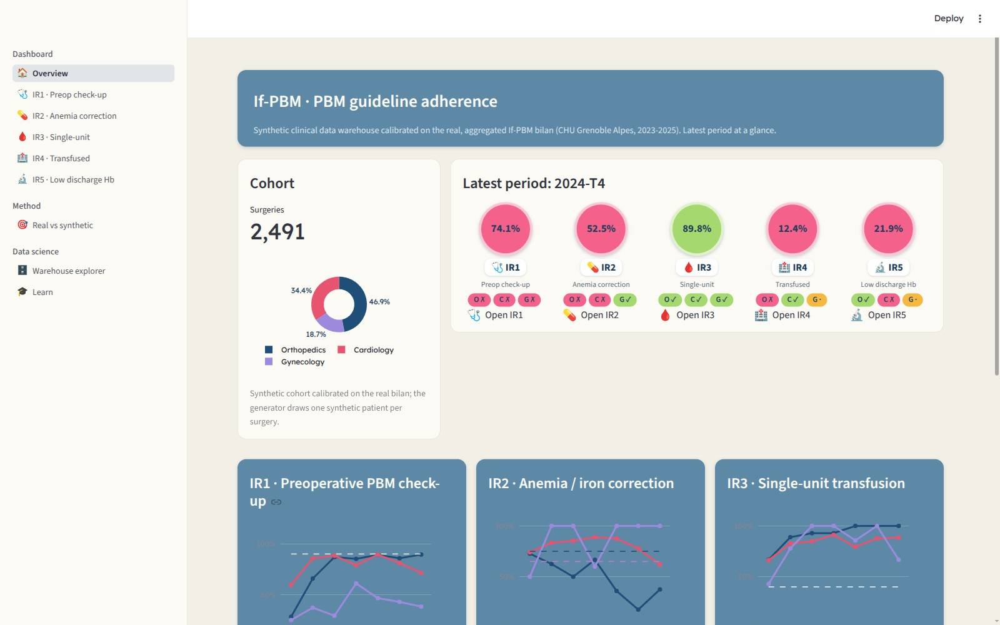
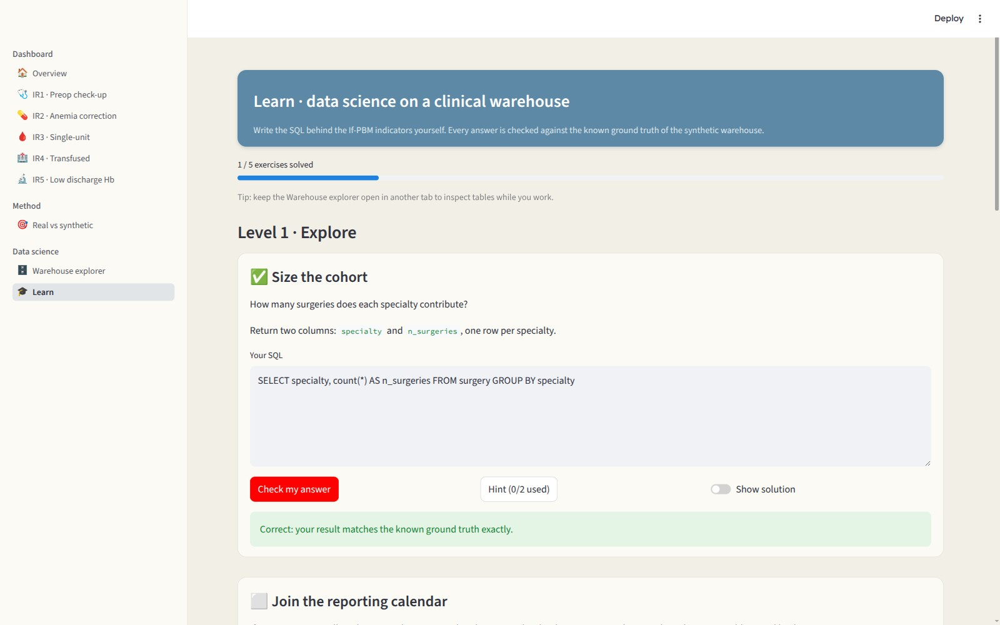

# If-PBM Open Platform


Reproducible, open-source platform around the **If-PBM** Patient Blood Management (PBM)
monitoring method described in the MIE2026 short communication *"Monitoring adherence to
PBM guidelines from clinical data warehouse: a case study"* (Beaudoin, Godon, Marquet,
Boulier, Moreau-Gaudry, Grenoble Alpes University Hospital).

It generates a **synthetic** clinical data warehouse calibrated on the **real, aggregated
If-PBM bilan**, computes the **five If-PBM indicators (IR1-IR5)** across orthopedics,
cardiology, and gynecology by trimester, and serves three things on top:

1. **Automatic dashboards**: every indicator page is generated from a single registry
   (definition, year-2 targets per specialty, SQL), so adding an indicator means one SQL
   file plus one registry entry.
2. **A demonstration of the known-ground-truth claim**: a calibration page overlays the
   official real aggregated values on the synthetic pipeline's results.
3. **A data science training track**: progressive SQL exercises on the warehouse,
   auto-validated against the ground truth, with hints and reference solutions.

No real patient data is involved; only aggregated, source-censored values are shipped.



## What it shows

| Indicator | Definition | Year-2 target |
|-----------|------------|---------------|
| IR1 | Standardized PBM preoperative check-ups | ≥ 90 % (all) |
| IR2 | Corrective treatments for anemia / iron deficiency | ortho ≥ 75 %, cardio/gyneco ≥ 65 % |
| IR3 | Single-unit transfusion episodes | ≥ 40 % (all) |
| IR4 | Patients transfused per- or post-operatively | ortho ≤ 5 %, cardio ≤ 25 % |
| IR5 | Patients discharged with low hemoglobin | ≤ 25 % (ortho/cardio) |

(The official criterion is "reach the target OR improve by a set margin vs baseline";
gynecology IR4/IR5 targets are split by procedure in the cahier des charges.)

## Architecture

The method is decoupled behind two stable seams (ports), so inputs and outputs are swappable:

```
 input adapters       canonical schema        indicators (SQL)      results mart        output adapters
 synthetic (here) ──▶ patient / surgery / ──▶ IR1..IR5 over     ──▶ indicator_results ─▶ Streamlit (here)
 real CDW (later)     transfusion / lab /      the canonical         (indicator x          Superset (later)
                      consultation             schema, in DuckDB     specialty x quarter)
                            ▲                        ▲                      ▲
                            │                        │                      │
                      explorer / Learn          registry.py            calibration page
                      (teaching surface)   (single source of truth:   (vs real_ir.csv, the
                                            labels, targets, SQL)      real aggregated bilan)
```

- **Input port** = the canonical schema. A real CDW adapter would simply produce conforming rows.
- **Output port** = the `indicator_results` table. BI pages read only this mart; the
  explorer and Learn pages deliberately expose the canonical tables, because the
  warehouse itself is the teaching surface.
- **Registry** (`registry.py`) = the single source of truth driving dashboard pages, KPI
  status colours, target bands, and exercise validation.

## Install

```bash
# Recommended: uv
uv tool install git+https://github.com/tomboulier/if-pbm-open-demo

# Or from a clone, for development
git clone https://github.com/tomboulier/if-pbm-open-demo
cd if-pbm-open-demo
uv sync
```

## Run

One command generates data, computes indicators, and launches the platform:

```bash
uv run if-pbm-demo demo
```

Or step by step:

```bash
uv run if-pbm-demo generate     # synthetic canonical data -> data/if_pbm.duckdb
uv run if-pbm-demo indicators   # compute IR1-IR5 -> indicator_results mart
uv run if-pbm-demo dashboard    # launch the Streamlit platform
```

## The training track

The Learn page turns the known ground truth into a teaching device: because every
indicator value of the synthetic warehouse is known by construction, a learner's SQL can
be checked **exactly** (columns case-insensitively, row order ignored, floats within
tolerance), with actionable feedback on mismatches. Five exercises, from counting the
cohort to rebuilding the IR3 transfusion-episode logic with window functions.



## Note on data

- Patient-level data is **synthetic**, generated by a seeded, calibrated model
  (`generate.py`): aggregating it reproduces the real bilan's count layer
  (`data/targets.csv`, small counts censored at the source).
- `data/real_ir.csv` ships the **real aggregated** official IR proportions (computed
  upstream with the "eligible excluding Voiron" denominator) used by the calibration
  page. Both CSVs are aggregated and GDPR-safe; the source bilan stays untracked.
